<style>
  .title {
    text-align: center;
    margin: 20px 0;
  }
  
  .content-wrapper {
    min-height: calc(100vh - 100px);
    position: relative;
  }
  
  .school-name {
    text-align: center;
    margin-top: 200px;
  }
</style>

<!-- <style>
  .code-block {
    margin-left: 2em;  /* 缩进距离 */
  }
  .code-block pre {
    background-color:rgb(218, 234, 251);  /* 代码块背景色 */
    padding: 16px;  /* 内边距 */
    border-radius: 6px;  /* 圆角边框 */
  }
</style> -->

<style>
  /* 代码块样式 */
  .code-block {
    margin-left: 2em;
  }
  .code-block pre {
    background-color: #f5f5f5 !important;
    padding: 1em;
    border-radius: 4px;
    margin: 1em 0;
  }

  /* 页码样式 */
  .page-number {
    position: running(pageNumber);
    text-align: center;
  }
  
  @page {
    margin: 1in;
    @bottom-center {
      content: counter(page);
    }
  }

  /* 首页和目录页不显示页码 */
  .no-page-number {
    page: no-number;
  }
  @page no-number {
    @bottom-center {
      content: none;
    }
  }
</style>

<div class="content-wrapper">

<div class="title">

# Python大作业说明文档

## 作业名称：文件同步工具的设计

</div>

**专业班级**：2023级计算机科学与技术一班、二班  
**组名**：响当当队
**组长**：饶甜甜320230943420  
**小组成员**：
- 李永翔320230940571
- 李尚泽320230940541

**指导教师**：詹建  
**实验日期**：2024年12月1日-12月21日

<div class="school-name">
兰州大学信息科学与工程学院
</div>


---
<!-- 分页符 -->
<div style="page-break-after: always"></div>


## 目录

- [Python大作业说明文档](#python大作业说明文档) ....................................... 1
  - [作业名称：文件同步工具的设计](#作业名称文件同步工具的设计) ........................ 1
  - [目录](#目录) .............................................................. 2
  - [1 设计目的与要求](#1-设计目的与要求) ......................................... 4
  - [2 设计概览](#2-设计概览) ................................................... 4
    - [2.1 小组分工](#21-小组分工) ............................................... 4
    - [2.2 设计特点](#22-设计特点) ............................................... 5
  - [3 设计原理](#3-设计原理) ................................................... 7
    - [3.1 软件需求分析](#31-软件需求分析) ........................................ 7
    - [3.2 软件的概要设计](#32-软件的概要设计) .................................... 8
    - [3.3 系统结构](#33-系统结构) ............................................... 10
    - [3.4 模块设计说明](#34-模块设计说明) ........................................ 11
    - [3.5 模块详细设计](#35-模块详细设计) ........................................ 11
      - [3.5.1 主窗口模块](#351-主窗口模块) ....................................... 11
      - [3.5.2 任务管理模块](#352-任务管理模块) .................................. 15
      - [3.5.3 自动同步模块](#353-自动同步模块) .................................. 17
      - [3.5.4 加密和解密模块](#354-加密和解密模块) .................................. 18
      - [3.5.5 日志记录模块](#355-日志记录模块) .................................. 19
  - [4 测试结果](#4-测试结果) .................................................. 19
    - [4.1 新建任务功能测试](#41-新建任务功能测试) ................................ 19
    - [4.2 手动同步功能测试](#42-手动同步功能测试) ................................ 21
    - [4.3 自动同步功能测试](#43-自动同步功能测试) ................................ 24
    - [4.4 删除任务功能测试](#44-删除任务功能测试) ................................ 25
    - [4.5 加密和解密功能测试](#45-加密和解密功能测试) ................................ 27
  - [5 讨论与结论](#5-讨论与结论) ............................................... 31
    - [5.1 遇到的困难](#51-遇到的困难) .......................................... 31
    - [5.2 收获](#52-收获) ..................................................... 31
</div>
<div style="page-break-after: always"></div>

---

## 1 设计目的与要求
1. **核心同步功能**
- 创建和管理同步任务(设置源路径和目标路径)
- 执行文件同步操作
- 增量同步(只同步变更文件)和删除同步
- 同步进度显示(显示当前同步文件名)

2. **技术要求**
- 使用 Tkinter 构建GUI界面
- 仅支持 Windows 平台运行
3. **拓展功能**
- 实用性提升
  - 打包为 exe 可执行文件
  - 自动同步(后台常驻)
  - 同步日志记录
  - 文件类型过滤(.tmp等临时文件)
- 性能优化
  - 多线程/多进程加速
- 高级特性
  - 版本控制功能
  - 文件加密功能(支持本地加密和目标路径加密)

## 2 设计概览

### 2.1 小组分工

- 饶甜甜负责基本功能实现和代码框架搭建以及自动同步功能，主要包括：
  - 界面设计：使用Tkinter搭建界面框架
  - 创建和保存任务：定义一个任务，选择本地文件夹以及目标文件路径，保存任务
  - 执行任务：选择一个任务，按“执行”，再开始同步
  - 同步简化：在同步时查看最新文件变换，没改变的就不替换
  - 显示文件名：实现同步时实时显示当前正在同步的文件名
  - 自动同步：实现后台常驻，自定义时间间隔自动化同步并显示同步时间
  - 同步日志：实现有同步日志可以查看 

- 李永翔主要负责几种细节功能地优化，主要包括：
  - 打包成exe：将项目打包成一个win平台下的 exe 文件, 并有附加的配置文件
  - 消除cmd弹窗：解决exe文件使用时地cmd弹窗问题
  - 命名问题：解决不能以数字开头命名任务的问题
  - 文件过滤：实现同步的时候过滤垃圾文件，不做同步，如.tmp, .~ 等
  - 删除文件：同步时实现本地删除的文件，目标路径下也删除
  - 多线程：尝试实现多线程优化同步时间

- 李尚泽主要负责代码结构的优化，主要包括：
  - 优化界面：对交互界面设计进行优化，使其更加清晰，容纳不同功能，独立对话框设置和输入密码
  - 加密：实现加密功能，使用base64模块的加解密函数，对文件进行加密，使用递归对文件夹进行加密
  - 文件夹操作问题：解决对文件夹无法直接操作的问题
  - 系统权限问题：解决程序被系统自动识别为病毒的问题
  - 面向对象技术：尝试利用面向对象的程序设计技术将代码进行模块化处理

### 2.2 设计特点
1. **架构设计**
 - 采用面向对象方式，使用 FileSyncTool 类作为主类统一管理所有功能
 - 遵循单一职责原则，各个方法功能明确，职责单一
 - 使用 MVC 模式的简化版本：
   - Model: 任务数据的管理和持久化
   - View: GUI 界面展示
   - Controller: 事件处理和业务逻辑

2. **核心功能模块**
- 配置管理：使用 JSON 持久化存储任务配置
- 文件同步：实现文件的增量同步和删除
- GUI 界面：基于 tkinter 实现用户交互
- 自动同步：使用独立线程进行定时同步
- 错误处理：统一的异常处理和日志记录机制

3. **优势特点**

- 线程安全
  
<div class="code-block">

```
# 使用独立线程处理耗时操作
threading.Thread(target=sync_thread, daemon=True).start()
```
</div>

- 错误处理机制
<div class="code-block">

```
pythonCopytry:
    # 操作代码
except Exception as e:
    error_msg = f"错误信息: {str(e)}"
    logging.error(error_msg)
    messagebox.showerror("错误", error_msg)
```
</div>


- 可扩展性
  - 任务配置采用 JSON 格式，易于扩展新的配置项
  - 界面组件封装良好，方便添加新功能
  - 同步逻辑独立封装，易于修改同步策略

4. **安全性考虑**
- 文件操作安全检查
- 配置文件访问保护
- 用户输入验证
- 特殊文件类型过滤

5. **用户体验设计**
- 实时状态反馈
- 操作确认对话框
- 进度显示
- 错误提示
- 自动同步配置灵活
## 3 设计原理
### 3.1 软件需求分析
1. **目标用户**
（1）个人用户：需要在不同设备或文件夹之间同步文件的个人。
（2）小型企业：需要在不同部门间同步数据的小型企业员工。

1. **可满足的功能需求**
（1）任务管理：创建新的同步任务、删除已存在的同步任务以及编辑同步任务的属性（如源路径、目标路径）。
（2）文件同步：同步指定源目录和目标目录之间的文件，支持文件的复制、更新和删除操作，并可以忽略特定类型的文件（如临时文件、备份文件等）。
（3）自动同步：设置任务以自动同步，无需用户干预。亦可以定义同步的时间间隔。
（4）用户界面：提供直观的图形用户界面（GUI），显示任务列表，包括任务名称、源路径、目标路径、最后同步时间等；提供状态栏，显示当前同步状态和错误信息。
（5）错误处理和日志：记录同步过程中的错误信息到一个日志文件，并在界面上显示同步错误，正常的操作则会保存在另一个日志文件中。
1. **非功能需求**
（1）性能：支持大量文件的快速同步，低资源占用，避免对系统性能造成影响；同时，程序采用了多线程模式，能够在处理大量文件时保持性能。
（2）可用性：界面友好，易于使用，并提供了帮助文档和用户指南。
（3）安全性：能够确保同步过程中数据的完整性，避免同步过程中的数据泄露。
（4）兼容性：程序被打包成.exe文件，支持主流操作系统平台。

### 3.2 软件的概要设计
1. **软件概要设计说明**
- 架构设计:程序前端使用了Python的Tkinter库构建GUI，提供任务管理界面、同步设置界面和状态显示；后端使用Python标准库中的os、shutil等模块进行文件操作，并使用json模块进行任务的序列化和反序列化；在数据存储方面，使用JSON文件存储同步任务配置，确保了在程序结束运行后数据仍然能够被保存；此外，还使用threading模块实现多线程，支持后台同步操作。
- 组件设计
（1）任务管理组件：负责创建、删除和编辑同步任务。
（2）文件同步组件：执行实际的文件同步操作，包括文件复制、更新和删除。
（3）自动同步组件：负责根据设定的时间间隔自动执行同步任务。
（4）日志记录组件：记录同步过程中的操作和错误信息以及操作记录。
- 用户界面设计
（1）主窗口：显示任务列表、工具栏和状态栏。
（2）工具栏：提供新建任务、删除任务、执行同步和自动同步设置的按钮。
（3）任务列表：显示所有同步任务及其详细信息。
（4）状态栏：显示当前同步状态和可能的错误信息。

2. **软件处理流程**
- 软件初始化流程
（1）初始化：设置应用程序路径和配置文件路径，配置日志记录，检查配置文件是否存在，加载已保存的任务到内存。
（2）创建GUI：创建并布局主窗口界面，包括工具栏、任务列表和状态栏，更新任务列表以显示已加载的任务。
（3）启动自动同步检查器 (在后台线程中)：检查是否启用了自动同步任务。对于每个启用了自动同步的任务，检查自上次同步以来的时间间隔。如果达到同步间隔，执行同步操作。
- 新建任务操作
（1）打开新建任务对话框。
（2）填写任务名称、源路径和目标路径。
（3）保存新任务到配置文件并更新任务列表。
- 删除任务操作
（1）在任务列表中选择一个任务。
（2）确认删除后，从内存和配置文件中移除任务。
（3）更新任务列表。
- 执行同步操作
（1）在任务列表中选择一个任务。
（2）在新线程中执行同步操作。
（3）更新任务状态和最后同步时间。
- 自动同步设置
（1）在任务列表中选择一个任务。
（2）打开自动同步设置对话框。
（3）启用/禁用自动同步并设置同步间隔。
（4）保存设置到配置文件。
- 同步操作 (在用户操作或自动同步检查中触发)
（1）确保目标目录存在，如果不存在则创建。
（2）遍历源目录，同步文件和目录到目标目录。
（3）删除在源目录中已删除但在目标目录中仍然存在的文件和目录。

<center>
    <div style="display: flex; justify-content: center; align-items: center; padding: 20px;">
        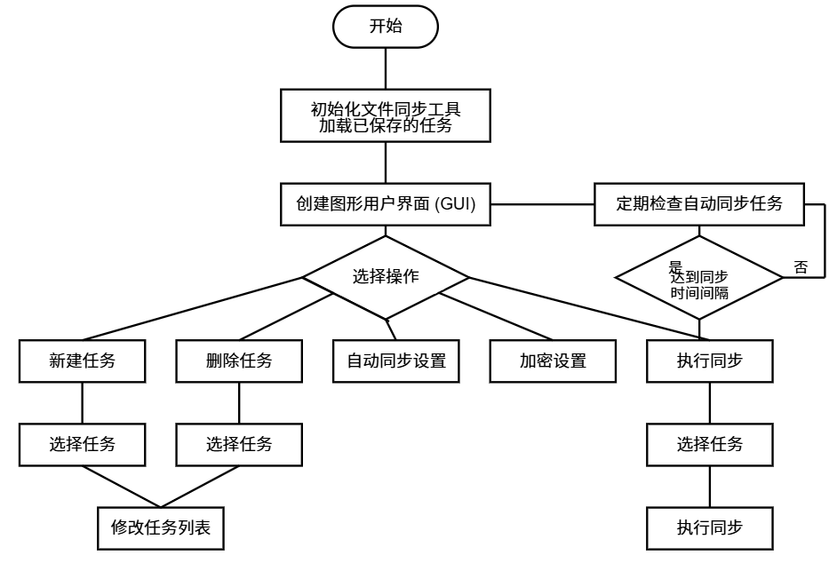
    </div>
    <div style="color: black; border-bottom: 1px solid #d9d9d9; display: inline-block; padding: 2px; text-align: center;">
        图3-2-2-1 软件运行流程图
    </div>
</center>


### 3.3 系统结构
<!--段前空格-->
&nbsp;&nbsp;&nbsp;&nbsp;&nbsp;&nbsp;&nbsp;该代码系统结构采用分层设计，包括前端GUI层、业务逻辑层和数据存储层，其中前端使用Tkinter库构建用户界面，业务逻辑层通过Python标准库中的模块进行文件操作和多线程管理，同时使用JSON文件进行任务配置的数据存储，确保了系统的高内聚低耦合，易于维护和扩展。
软件架构图如图3-3-1所示。


<center>
    <div style="display: flex; justify-content: center; align-items: center; padding: 20px;">
        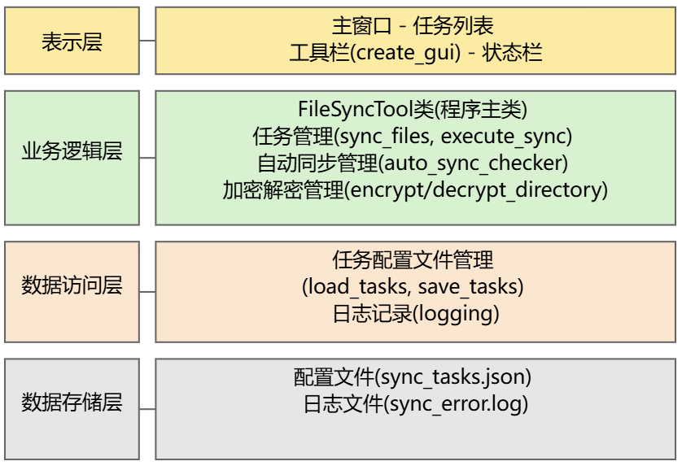
    </div>
    <div style="color: black; border-bottom: 1px solid #d9d9d9; display: inline-block; padding: 2px; text-align: center;">
        图3-3-1 软件运行流程图
    </div>
</center>

### 3.4 模块设计说明
&nbsp;&nbsp;&nbsp;&nbsp;&nbsp;&nbsp;&nbsp;整个系统共划分为4个模块：主窗口模块、任务管理模块、自动同步模块和日志记录模块。各个模块的具体设计和原理如下。

### 3.5 模块详细设计
#### 3.5.1 主窗口模块
&nbsp;&nbsp;&nbsp;&nbsp;&nbsp;&nbsp;&nbsp;主窗口模块通过Tkinter库创建一个图形用户界面（GUI），为用户提供交互操作的平台。它负责初始化程序、加载任务、显示任务列表、提供操作按钮以及显示程序状态。其设计目的是提供一个用户友好的界面，让用户能够轻松地管理同步任务，包括添加、删除、执行和配置自动同步任务。主窗口模块各个组成方法的具体原理如下。

1. **init(self, root)**
初始化软件界面，创建各功能模块。
__详细代码解释：__
&nbsp;&nbsp;&nbsp;&nbsp;&nbsp;&nbsp;&nbsp;方法首先将传入的root赋值给实例变量，以便在类中其他方法中使用主窗口。之后设置主窗口的标题和初始大小配置文件和日志文件的路径。在设置路径时，需首先通过`os.path.dirname(os.path.abspath(sys.argv[0]))`获取当前执行脚本所在的目录，然后再定义任务配置文件的路径和错误日志文件的路径。
&nbsp;&nbsp;&nbsp;&nbsp;&nbsp;&nbsp;&nbsp;之后初始化自动同步线程变量（用于存储自动同步的线程对象）和自动同步运行状态标志（用于指示自动同步是否正在运行）

<div class="code-block">

```
self.auto_sync_thread = None
self.auto_sync_running = False
```

</div>

&nbsp;&nbsp;&nbsp;&nbsp;&nbsp;&nbsp;&nbsp;使用`logging`模块的`basicConfig`方法配置日志记录，包括设置日志记录的级别为ERROR、设置日志记录的时间戳、日志级别和消息等格式。
&nbsp;&nbsp;&nbsp;&nbsp;&nbsp;&nbsp;&nbsp;之后通过`os.path.exists(self.tasks_file)`检查确保任务配置文件存在，若不存在则打开文件重新进行写入。同时使用一个try块来捕获可能发生的异常。
&nbsp;&nbsp;&nbsp;&nbsp;&nbsp;&nbsp;&nbsp;最后，调用`load_tasks()`方法加载任务配置，调用`create_gui()`方法创建图形用*户界面。


2. **create_gui(self)**
&nbsp;&nbsp;&nbsp;&nbsp;&nbsp;&nbsp;&nbsp;创建图形用户界面，包括创建主框架、工具栏、任务列表框架、状态栏等基本组件，添加工具栏按钮和任务列表列头，创建垂直滚动条，启动自动同步检查器等功能。
__详细代码解释：__
&nbsp;&nbsp;&nbsp;&nbsp;&nbsp;&nbsp;&nbsp;方法首先通过`ttk.Frame()`和`pack()`方法创建主框架，设置内边距为5像素；同时设置其为允许其填充整个窗口并随窗口大小变化而扩展。
&nbsp;&nbsp;&nbsp;&nbsp;&nbsp;&nbsp;&nbsp;通过`ttk.Frame()``toolbar.pack()`将工具栏框架添加到主框架，并允许其在水平方向上填充，设置垂直外边距为(0, 5)。
&nbsp;&nbsp;&nbsp;&nbsp;&nbsp;&nbsp;&nbsp;使用`ttk.Button`添加工具栏按钮（新建任务按钮、删除任务按钮、执行同步按钮、自动同步设置按钮），且均设置为左端对齐。
&nbsp;&nbsp;&nbsp;&nbsp;&nbsp;&nbsp;&nbsp;之后将任务列表框架添加到主框架，允许其填充整个窗口并随窗口大小变化而扩展，并设置标签。
<div class="code-block">

```
list_frame = ttk.LabelFrame(main_frame, text="同步任务列表", padding="5")
list_frame.pack(fill=tk.BOTH, expand=True)
```

</div>

&nbsp;&nbsp;&nbsp;&nbsp;&nbsp;&nbsp;&nbsp;使用`columns`创建表格视图，显示列标题，选择模式为浏览。之后通过`self.tree.column()`设置表格列头和列宽。
&nbsp;&nbsp;&nbsp;&nbsp;&nbsp;&nbsp;&nbsp;使用`ttk.Scrollbar()`设置表格视图的垂直滚动条，并绑定到表格视图的垂直滚动命令。
<div class="code-block">

```
scrollbar = ttk.Scrollbar(list_frame, orient=tk.VERTICAL, command=self.tree.yview)
self.tree.configure(yscrollcommand=scrollbar.set)
``` 

</div>

&nbsp;&nbsp;&nbsp;&nbsp;&nbsp;&nbsp;&nbsp;放置表格视图和滚动条，将状态栏标签添加到主框架，并允许其在水平方向上填充，设置垂直外边距为(5, 0)。
&nbsp;&nbsp;&nbsp;&nbsp;&nbsp;&nbsp;&nbsp;最后，调用`self.update_task_list()`方法更新任务列表，调用`self.start_auto_sync_checker()`方法启动自动同步检查。


3. **how_auto_sync_settings(self)**
&nbsp;&nbsp;&nbsp;&nbsp;&nbsp;&nbsp;&nbsp;显示自动同步设置对话框，同时创建设置对话框，包括添加自动同步开关和同步间隔设置、保存设置并更新任务列表等。
__详细代码解释：__
&nbsp;&nbsp;&nbsp;&nbsp;&nbsp;&nbsp;&nbsp;首先通过selection()方法获取当前在任务列表中选中的任务。
<div class="code-block">

```
selected = self.tree.selection()
```

</div>

&nbsp;&nbsp;&nbsp;&nbsp;&nbsp;&nbsp;&nbsp;若未选中任何任务，则弹出警告窗口。
<div class="code-block">

```
messagebox.showwarning("警告", "请选择要设置的任务！")  # 显示警告消息
```

</div>

&nbsp;&nbsp;&nbsp;&nbsp;&nbsp;&nbsp;&nbsp;之后，获取选中任务的值，并创建一个新的顶级对话框窗口。这里采用了生成器表达式遍历 `self.tasks`列表中的每一个任务`t`，并检查任务字典中的`name`键的值是否等于`task_name`，以此来找到匹配的任务。

<div class="code-block">

```
# 从任务列表中找到匹配的任务配置
task = next((t for t in self.tasks if t['name'] == task_name), None)
if not task:  # 如果没有，则退出方法
    return 
```

</div>
&nbsp;&nbsp;&nbsp;&nbsp;&nbsp;&nbsp;&nbsp;进行对话框的设置：创建对话框内部的设置框架（设置为允许填充和扩展），创建自动同步的开关按钮，以及添加同步间隔设置的标签和输入框。
&nbsp;&nbsp;&nbsp;&nbsp;&nbsp;&nbsp;&nbsp;之后在方法内定义了保存自动同步设置的函数`save_settings()`，其主要目的是保存用户在对话框中输入的设置，包括自动同步和同步间隔。方法首先输入符合要求的同步间隔时间，之后更新任务配置中的自动同步和同步间隔。此外，整个函数体放在try代码块中，方便捕获异常。
&nbsp;&nbsp;&nbsp;&nbsp;&nbsp;&nbsp;&nbsp;最后，使用`ttk.Button()`添加保存和取消按钮，保存按钮设置垂直外边距为10像素，取消按钮设置垂直外边距为5像素。


4. **start_auto_sync_checker(self)**
&nbsp;&nbsp;&nbsp;&nbsp;&nbsp;&nbsp;&nbsp;创建并启动自动同步检查线程。该检查器会定期检查并执行符合条件的自动同步任务。
__详细代码解释：__
&nbsp;&nbsp;&nbsp;&nbsp;&nbsp;&nbsp;&nbsp;首先在方法体内创建一个auto_sync_checker()方法作为自动同步检查器函数，无限循环检查每个任务是否需要同步。整个方法被放在try代码块中，便于捕获异常。
&nbsp;&nbsp;&nbsp;&nbsp;&nbsp;&nbsp;&nbsp;之后，启动自动同步检查线程。`not self.auto_sync_thread`和`not self.auto_sync_thread.is_alive()`两式的值相与来判断，如果结果为真，则证明自动同步线程不存在或已停止，通过`threading.Thread()`创建并启动新的线程。


5. **update_task_list(self)**
&nbsp;&nbsp;&nbsp;&nbsp;&nbsp;&nbsp;&nbsp;更新任务列表显示。首先清空现有列表，之后添加所有任务到列表，从而达到更新任务列表显示的目的。
__详细代码解释：__
&nbsp;&nbsp;&nbsp;&nbsp;&nbsp;&nbsp;&nbsp;首先遍历当前树形视图中的所有子项，并删除它们以清空列表。
<div class="code-block">

```
for item in self.tree.get_children():
    self.tree.delete(item)  # 删除树形视图中的当前子项
```

</div>

&nbsp;&nbsp;&nbsp;&nbsp;&nbsp;&nbsp;&nbsp;之后遍历self.tasks中的每个任务（self.tasks是一个包含任务详情的列表），检查任务是否启用了自动同步。如果任务设置了自动同步，则通过`auto_sync_text = f"{task.get('sync_interval', 30)}分钟`"来显示同步间隔时间并设置相应的显示文本；如果没有设置自动同步，则显示"否"。最后通过`self.tree.insert()`将任务信息插入到树形视图中。


#### 3.5.2 任务管理模块
&nbsp;&nbsp;&nbsp;&nbsp;&nbsp;&nbsp;&nbsp;任务管理模块通过操作JSON文件来存储和读取同步任务。它包含了一系列函数，用于处理任务的添加、删除和执行。其设计目的是简化任务的管理过程，确保用户能够方便地添加新任务、删除不需要的任务以及执行同步操作。

1. **new_task(self)**
&nbsp;&nbsp;&nbsp;&nbsp;&nbsp;&nbsp;&nbsp;创建新的同步任务。包括创建任务对话框，输入任务名称、源路径和目标路径，以及保存新任务并更新任务列表。
__详细代码解释：__
&nbsp;&nbsp;&nbsp;&nbsp;&nbsp;&nbsp;&nbsp;首先创建一个新的顶级窗口（对话框），设置对话框的标题、初始大小，将对话框设置为根窗口的临时窗口模态，以及设置对话框为模态，使其在关闭前阻止用户与主窗口交互。
&nbsp;&nbsp;&nbsp;&nbsp;&nbsp;&nbsp;&nbsp;之后进行对话框设置。包括创建对话框的主框架并设置内边距，并将输入框放置在主框架中，以及创建对话框组件，包括创建任务名称输入框，源路径选择标签和输入框、浏览按钮，目标路径选择标签、输入框和浏览按钮等。
&nbsp;&nbsp;&nbsp;&nbsp;&nbsp;&nbsp;&nbsp;此外，方法体内还定义了保存函数`save()`，用于保存新创建的同步任务。在保存执行时，还对任务是否合规进行了验证。
&nbsp;&nbsp;&nbsp;&nbsp;&nbsp;&nbsp;&nbsp;最后，通过`ttk.Button()`创建按钮框架并添加保存和取消按钮。


2. **delete_task(self)**
&nbsp;&nbsp;&nbsp;&nbsp;&nbsp;&nbsp;&nbsp;删除选中的同步任务并获取选中的任务，以此来更新任务列表。
__详细代码解释：__
&nbsp;&nbsp;&nbsp;&nbsp;&nbsp;&nbsp;&nbsp;方法首先获取获取用户在树形控件中选中的项，
<div class="code-block">

```
selected = self.tree.selection()
```

</div>

&nbsp;&nbsp;&nbsp;&nbsp;&nbsp;&nbsp;&nbsp;如果没有选中任何项则弹出警告窗口。
<div class="code-block">

```
messagebox.showwarning("警告", "请选择要删除的任务！")  # 显示警告消息框，提示用户选择任务
```

</div>

&nbsp;&nbsp;&nbsp;&nbsp;&nbsp;&nbsp;&nbsp;之后执行删除操作。首先通过弹出一个确认对话框询问用户是否确定删除。如果确定，则获取选中项的值，通常是一个包含任务详细信息的列表或元组。
<div class="code-block">

```
task_values = self.tree.item(selected[0])['values']
```

</div>

&nbsp;&nbsp;&nbsp;&nbsp;&nbsp;&nbsp;&nbsp;获取之后从任务列表中移除选中的任务，通过列表推导式过滤掉与选中任务名称相同的任务。最后，调用方法`self.save_tasks()`保存更新后的任务列表，并使用`self.update_task_list()`方法更新界面上的任务列表以反映删除操作后的结果。


3. **execute_sync(self)**
&nbsp;&nbsp;&nbsp;&nbsp;&nbsp;&nbsp;&nbsp;执行选中的同步任务。首先获取选中的任务，之后在新线程中执行同步操作，并更新任务列表和状态显示。
__详细代码解释：__
&nbsp;&nbsp;&nbsp;&nbsp;&nbsp;&nbsp;&nbsp;方法首先获取获取用户在树形控件中选中的项，如果没有选中任何项则弹出警告窗口。
之后获取选中的任务（包含任务详细信息），从任务列表中找到匹配的任务。
<div class="code-block">

```
task = next((t for t in self.tasks if t['name'] == task_name), None)
```

</div>

&nbsp;&nbsp;&nbsp;&nbsp;&nbsp;&nbsp;&nbsp;定义一个线程函数`sync_thread()`，用于同步任务源和目标之间的文件、更新任务的最后同步时间、保存更新后的任务列表、更新界面上的任务列表，以及显示同步状态。如果找到了匹配的任务，则调用sync_files方法执行；如果同步失败，函数会跳过同步成功部分的代码，直接执行同步失败部分的代码。
&nbsp;&nbsp;&nbsp;&nbsp;&nbsp;&nbsp;&nbsp;最后，启动同步线程，创建并启动一个新线程来执行sync_thread函数，并设置为守护线程。
<div class="code-block">

```
threading.Thread(target=sync_thread, daemon=True).start()
```
</div>


4. **sync_files(self, source_dir, target_dir)**
&nbsp;&nbsp;&nbsp;&nbsp;&nbsp;&nbsp;&nbsp;执行文件同步操作。首先确保目标目录存在，之后遍历源目录，同步文件并清理掉目标目录中已删除的文件。
__详细代码解释：__
&nbsp;&nbsp;&nbsp;&nbsp;&nbsp;&nbsp;&nbsp;首先确保目标目录存在。检查目标目录是否存在，如果不存在，则创建目标目录及其所有必要的父目录。
<div class="code-block">

```
try:
    if not os.path.exists(target_dir):
        os.makedirs(target_dir)
```

</div>

&nbsp;&nbsp;&nbsp;&nbsp;&nbsp;&nbsp;&nbsp;之后，遍历源目录（分别遍历当前目录下的所有子目录、当前目录下的所有文件），创建目标目录结构，并执行选定的同步文件操作。同时，通过`self.status_var.set()`增加更新状态的显示，通过`self.root.update_idletasks()`强制更新UI以显示状态信息。    
&nbsp;&nbsp;&nbsp;&nbsp;&nbsp;&nbsp;&nbsp;执行后检查目标文件是否存在或源文件是否更新。当检查到目标文件不存在或源文件更新，则启动一个新线程来复制文件。
&nbsp;&nbsp;&nbsp;&nbsp;&nbsp;&nbsp;&nbsp;最后，调用`self.delete_deleted_files()`方法删除在源目录中已删除但在目标目录中仍然存在的文件，并返回同步是否成功。


5. **delete_deleted_files(self, source_dir, target_dir)**
&nbsp;&nbsp;&nbsp;&nbsp;&nbsp;&nbsp;&nbsp;遍历目标目录，删除已删除的文件和空目录。
__详细代码解释：__
&nbsp;&nbsp;&nbsp;&nbsp;&nbsp;&nbsp;&nbsp;方法首先遍历目标目录及其所有子目录（遍历方式同上），并据此构建源子目录的完整路径；之后检查源文件是否存在，若不存在则删除目标目录中的文件。


#### 3.5.3 自动同步模块
&nbsp;&nbsp;&nbsp;&nbsp;&nbsp;&nbsp;&nbsp;自动同步模块通过一个后台线程定期检查任务列表，根据用户设置的同步间隔和上次同步时间，自动执行同步操作。其设计目的是减少用户手动操作的频率，以实现任务的自动化同步，提高效率。

&nbsp;&nbsp;&nbsp;&nbsp;&nbsp;&nbsp;&nbsp;自动同步模块的功能主要通过自动同步检查器`auto_sync_checker()`实现，它通过循环检查任务列表，查找并执行符合条件的同步任务。
__详细代码解释：__
&nbsp;&nbsp;&nbsp;&nbsp;&nbsp;&nbsp;&nbsp;`auto_sync_checker()`方法被创建于`start_auto_sync_checker(self)`方法中，作为自动同步检查器函数而使用。它通过`while True`进行无限循环，检查每个启用了自动同步的任务是否需要同步。如果需要，则调用`self.sync_single_task()`方法同步任务。方法中通过`interval_minutes = task.get('sync_interval', 30)`获取了同步间隔（分钟），如果没有设置则默认为30分钟。
&nbsp;&nbsp;&nbsp;&nbsp;&nbsp;&nbsp;&nbsp;此外，整个方法被放在`try`代码块中，便于捕获异常并进行日志记录。


#### 3.5.4 加密和解密模块
&nbsp;&nbsp;&nbsp;&nbsp;&nbsp;&nbsp;&nbsp;加密模块用于将指定目录下的文件进行加密处理。加密使用Base64编码，这是一种常见的编码方式，可以将二进制数据转换为ASCII字符，便于存储和传输；解密模块用于将加密后的文件还原为原始状态。解密同样使用Base64编码，通过解码操作将ASCII字符还原为二进制数据。

1. **encrypt_file(self, file_path)，decrypt_file(self, file_path)：**
&nbsp;&nbsp;&nbsp;&nbsp;&nbsp;&nbsp;&nbsp;对单个文件进行加密和解密。
__详细代码解释：__
&nbsp;&nbsp;&nbsp;&nbsp;&nbsp;&nbsp;&nbsp;方法首先读取文件内容，加密时使用Base64编码将编码后的数据写回文件；解密时使用Base64解码将解码后的数据写回文件。


2. **encrypt_directory(self, dir_path)，decrypt_directory(self, dir_path)**
&nbsp;&nbsp;&nbsp;&nbsp;&nbsp;&nbsp;&nbsp;对指定目录下的所有文件进行加密或解密。
__详细代码解释：__
&nbsp;&nbsp;&nbsp;&nbsp;&nbsp;&nbsp;&nbsp;方法首先递归地遍历目录及其子目录，之后对每个文件调用encrypt_file方法或decrypt_file方法进行加密或解密。


3. **show_encrypt_settings(self)，show_decrypt_settings(self)：**
&nbsp;&nbsp;&nbsp;&nbsp;&nbsp;&nbsp;&nbsp;显示加密和解密设置对话框。
__详细代码解释：__
&nbsp;&nbsp;&nbsp;&nbsp;&nbsp;&nbsp;&nbsp;显示加密设置对话框，允许用户选择加密路径和启用加密功能，其中包含了选择加密路径的选项和启用加密的复选框。用户保存设置后，会弹出一个密码输入对话框，用户输入密码后，程序会调用encrypt_directory方法进行加密。
&nbsp;&nbsp;&nbsp;&nbsp;&nbsp;&nbsp;&nbsp;显示解密设置对话框，允许用户选择解密路径和启用解密功能。
原理：创建一个对话框，包含选择解密路径的选项和启用解密的复选框。用户保存设置后，会弹出一个密码输入对话框，用户输入密码后，程序会调用decrypt_directory方法进行解密。


#### 3.5.5 日志记录模块
&nbsp;&nbsp;&nbsp;&nbsp;&nbsp;&nbsp;&nbsp;日志记录模块使用Python的logging库来记录程序运行过程中的错误信息。这些信息被保存在一个日志文件中，便于问题的追踪和解决。其设计目的是为了在程序出现异常时，能够提供错误信息，帮助开发者诊断问题，同时也为用户提供错误反馈。
__详细代码解释：__
&nbsp;&nbsp;&nbsp;&nbsp;&nbsp;&nbsp;&nbsp;日志记录设置的初始化由`logging.basicConfig()`方法执行，它位于FileSyncTool类的`__init__`方法中。
&nbsp;&nbsp;&nbsp;&nbsp;&nbsp;&nbsp;&nbsp;`logging.basicConfig()`方法主要包括配置了日志记录器，将错误信息记录到sync_error.log文件中，将正常的操作记录到sync_operation.log文件，指定日志文件的路径，日志级别为`ERROR`并设置了日志格式。
<div class="code-block">

```
format='%(asctime)s - %(levelname)s - %(message)s' # 设置日志记录的格式，包含时间戳、日志级别和消息
```

</div>

&nbsp;&nbsp;&nbsp;&nbsp;&nbsp;&nbsp;&nbsp;之后的日志记录主要在`__init__`、`start_auto_sync_checker`、`sync_files`、`load_tasks`、`save_tasks`和`delete_deleted_files`等方法中实现，主要涉及以下几个部分：
在`__init__`方法中，如果初始化配置文件失败，会记录错误日志并显示错误消息，成功则计入操作日志。
在`start_auto_sync_checker`方法中的`auto_sync_checker`函数中记录自动同步检查错误，如果发生异常，会记录错误日志（sync_error.log）。针对普通的操作，也会记录进另一个日志文件（sync_operation.log）。
&nbsp;&nbsp;&nbsp;&nbsp;&nbsp;&nbsp;&nbsp;模块在`sync_files`方法中记录同步失败错误，如果同步操作失败，会记录错误日志并显示错误消息，同时将操作记录写入。
&nbsp;&nbsp;&nbsp;&nbsp;&nbsp;&nbsp;&nbsp;此外，此模块内还添加了分别记录加载任务失败错误、保存任务失败错误、删除文件失败错误的模块，所有错误均会被记录为错误日志并显示错误消息，所有操作也会记入日志文件。


<!--

<center>
    
    <br>
    <div style="color:orange; border-bottom: 1px solid #d9d9d9;
    display: inline-block;
    color: #999;
    padding: 2px;">
      在这里插入图片注释
  	</div>
</center>

-->


## 4 测试结果
### 4.1 新建任务功能测试
   - 打开.exe文件，点击左上角“新建任务”按键，弹出新建任务窗口，输入任务名称、源路径以及目标路径等信息，点击“确定”按钮，任务信息保存到.json文件中,并在同步任务列表中显示。


<center>
    <div style="display: flex; justify-content: center; align-items: center; padding: 20px;">
        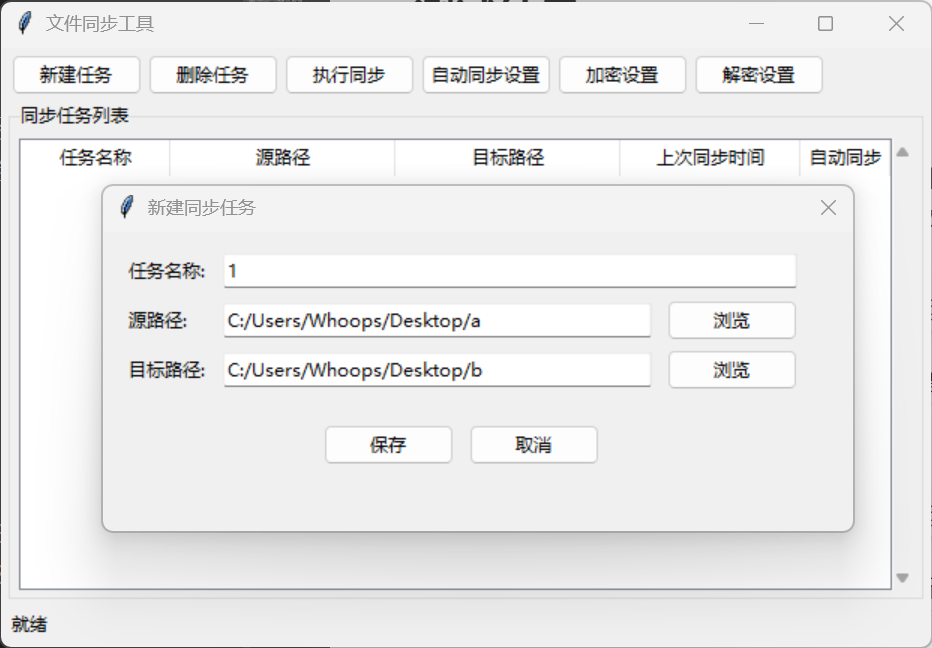
    </div>
    <div style="color: black; border-bottom: 1px solid #d9d9d9; display: inline-block; padding: 2px; text-align: center;">
        图4-1-1 新建同步任务界面
    </div>
</center>


   - 新建成功

<center>
    <div style="display: flex; justify-content: center; align-items: center; padding: 20px;">
        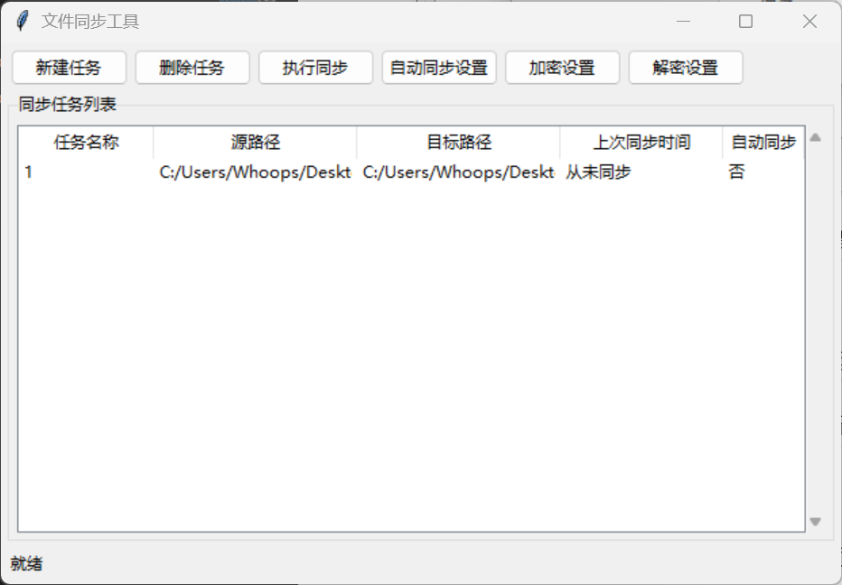
    </div>
    <div style="color: black; border-bottom: 1px solid #d9d9d9; display: inline-block; padding: 2px; text-align: center;">
        图4-1-2 新建成功界面
    </div>
</center>

  - json文件中保存了新建的任务信息

<center>
    <div style="display: flex; justify-content: center; align-items: center; padding: 20px;">
        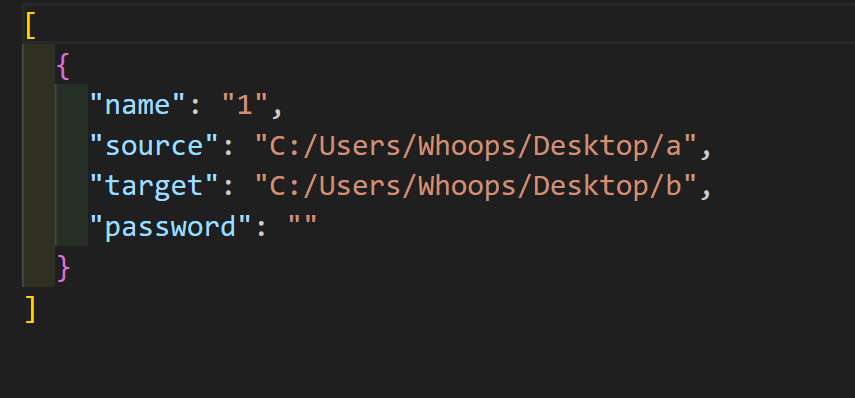
    </div>
    <div style="color: black; border-bottom: 1px solid #d9d9d9; display: inline-block; padding: 2px; text-align: center;">
        图4-1-3 新建后json文件
    </div>
</center>

### 4.2 手动同步功能测试
   - 点击同步任务列表中的任务，再点击上方“开始同步”按钮，开始同步文件。


<center>
    <div style="display: flex; justify-content: center; align-items: center; padding: 20px;">
        
    </div>
    <div style="color: black; border-bottom: 1px solid #d9d9d9; display: inline-block; padding: 2px; text-align: center;">
        图4-2-1 源路径文件列表
    </div>
</center>


<center>
    <div style="display: flex; justify-content: center; align-items: center; padding: 20px;">
        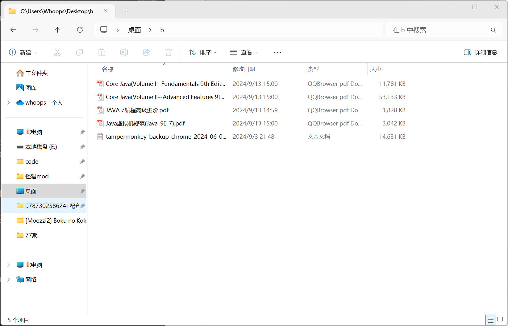
    </div>
    <div style="color: black; border-bottom: 1px solid #d9d9d9; display: inline-block; padding: 2px; text-align: center;">
        图4-2-2 目标路径文件列表
    </div>
</center>


   - 同步成功

<center>
    <div style="display: flex; justify-content: center; align-items: center; padding: 20px;">
        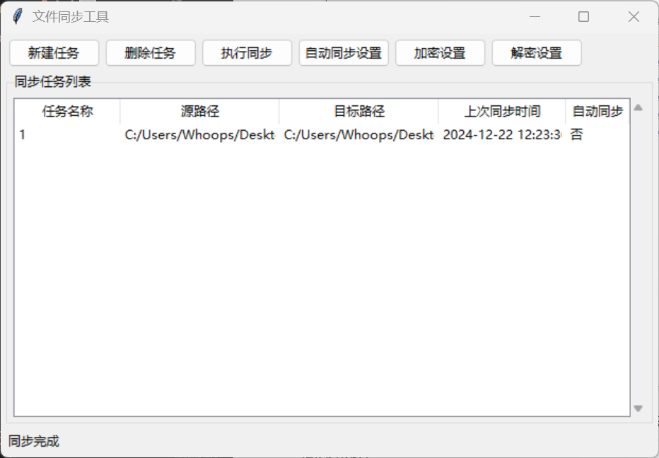
    </div>
    <div style="color: black; border-bottom: 1px solid #d9d9d9; display: inline-block; padding: 2px; text-align: center;">
        图4-2-3 同步成功界面
    </div>
</center>


<center>
    <div style="display: flex; justify-content: center; align-items: center; padding: 20px;">
        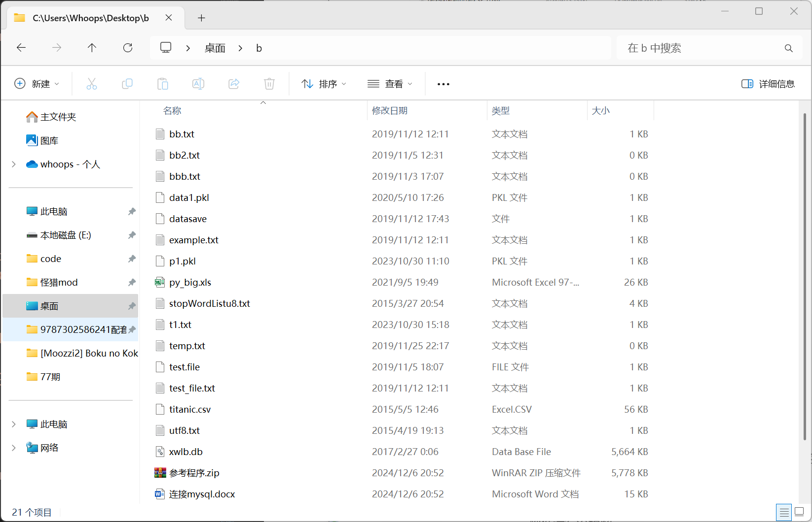
    </div>
    <div style="color: black; border-bottom: 1px solid #d9d9d9; display: inline-block; padding: 2px; text-align: center;">
        图4-2-4 目标路径文件列表
    </div>
</center>

### 4.3 自动同步功能测试
   - 点击同步任务列表中的任务，再点击上方“自动同步设置”按钮，弹出自动同步设置窗口，设置是否开启自动同步、自动同步的时间间隔，点击“保存”按钮，设置保存到.json文件中。
  

<center>
    <div style="display: flex; justify-content: center; align-items: center; padding: 20px;">
        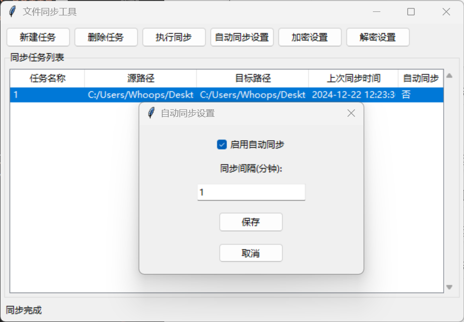
    </div>
    <div style="color: black; border-bottom: 1px solid #d9d9d9; display: inline-block; padding: 2px; text-align: center;">
        图4-3-1 设置自动同步界面
    </div>
</center>


<center>
    <div style="display: flex; justify-content: center; align-items: center; padding: 20px;">
        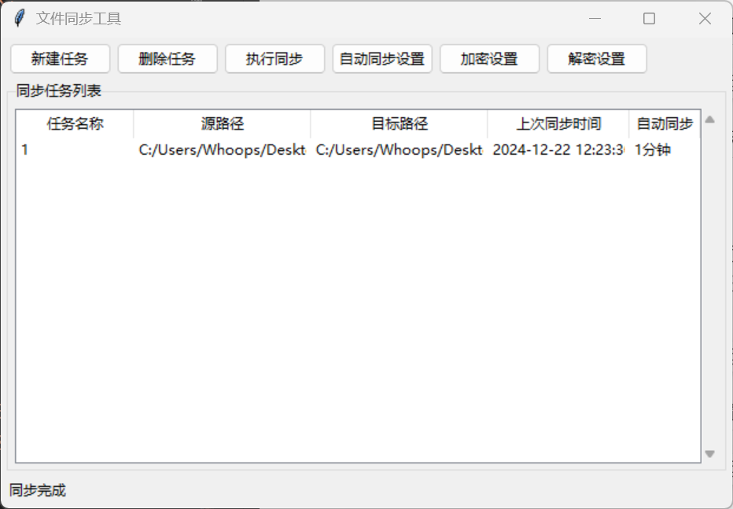
    </div>
    <div style="color: black; border-bottom: 1px solid #d9d9d9; display: inline-block; padding: 2px; text-align: center;">
        图4-3-2 设置结束后界面
    </div>
</center>


### 4.4 删除任务功能测试
- 点击同步任务列表中的任务，再点击上方“删除任务”按钮，设置保存到.json文件中。


<center>
    <div style="display: flex; justify-content: center; align-items: center; padding: 20px;">
        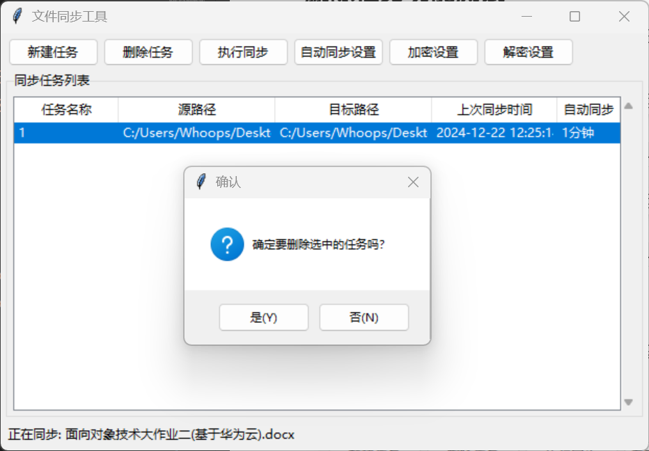
    </div>
    <div style="color: black; border-bottom: 1px solid #d9d9d9; display: inline-block; padding: 2px; text-align: center;">
        图4-4-1 删除任务界面
    </div>
</center>


<center>
    <div style="display: flex; justify-content: center; align-items: center; padding: 20px;">
        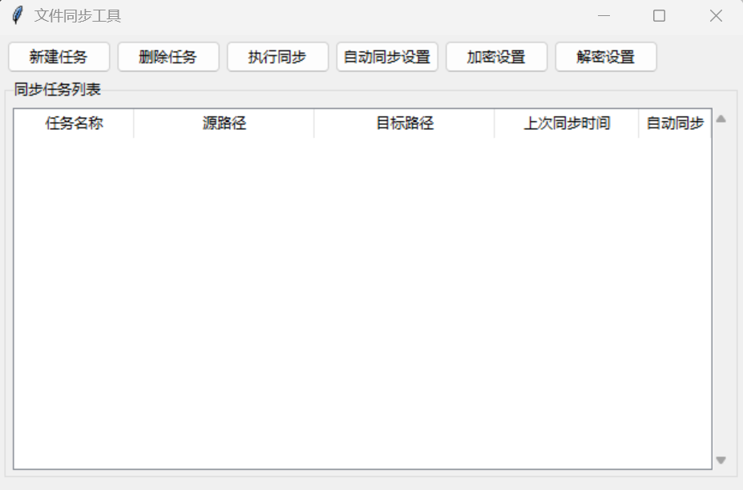
    </div>
    <div style="color: black; border-bottom: 1px solid #d9d9d9; display: inline-block; padding: 2px; text-align: center;">
        图4-4-2 删除成功界面
    </div>
</center>

<center>
    <div style="display: flex; justify-content: center; align-items: center; padding: 20px;">
        
    </div>
    <div style="color: black; border-bottom: 1px solid #d9d9d9; display: inline-block; padding: 2px; text-align: center;">
        图4-4-3 删除后json文件
    </div>
</center>

<center>
    <div style="display: flex; justify-content: center; align-items: center; padding: 20px;">
        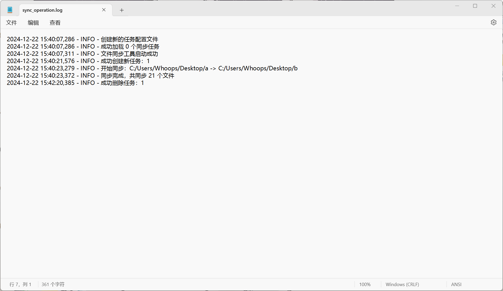
    </div>
    <div style="color: black; border-bottom: 1px solid #d9d9d9; display: inline-block; padding: 2px; text-align: center;">
        图4-4-3 日志文件
    </div>
</center>


### 4.5 加密与解密功能测试
- 点击同步任务列表中的任务，再点击上方“加密设置”按钮，选择“源文件”测试为源文件进行加密。


<center>
    <div style="display: flex; justify-content: center; align-items: center; padding: 20px;">
        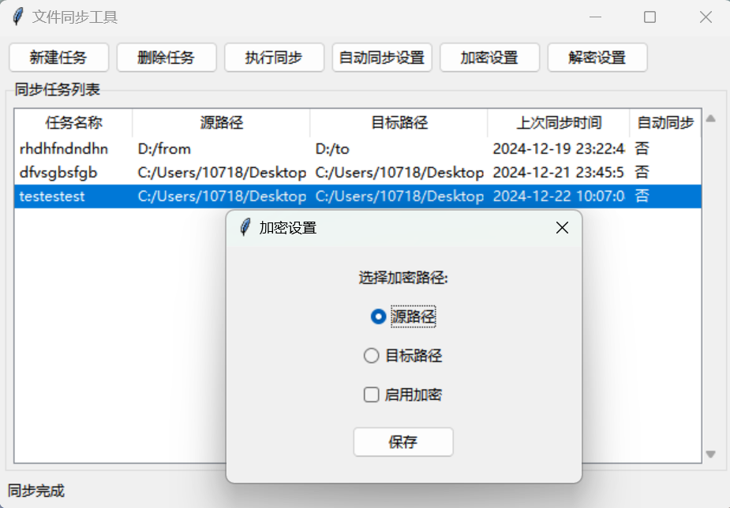
    </div>
    <div style="color: black; border-bottom: 1px solid #d9d9d9; display: inline-block; padding: 2px; text-align: center;">
        图4-5-1 启动加密
    </div>
</center>

- 设置密码，注意密码输入应保持一致。

<center>
    <div style="display: flex; justify-content: center; align-items: center; padding: 20px;">
        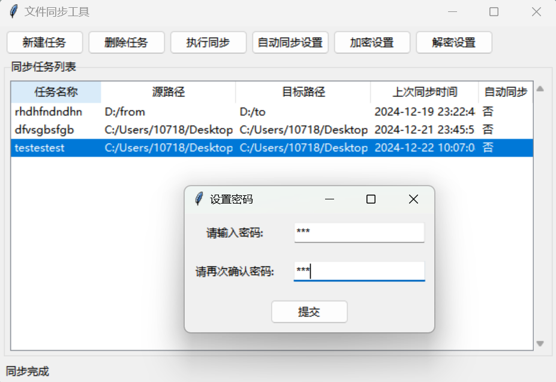
    </div>
    <div style="color: black; border-bottom: 1px solid #d9d9d9; display: inline-block; padding: 2px; text-align: center;">
        图4-5-2 设置密码
    </div>
</center>

<center>
    <div style="display: flex; justify-content: center; align-items: center; padding: 20px;">
        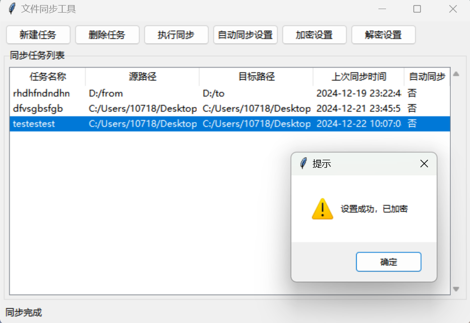
    </div>
    <div style="color: black; border-bottom: 1px solid #d9d9d9; display: inline-block; padding: 2px; text-align: center;">
        图4-5-3 加密成功
    </div>
</center>

- 加密成功，被加密文件夹里的文件已无法正常打开。

<center>
    <div style="display: flex; justify-content: center; align-items: center; padding: 20px;">
        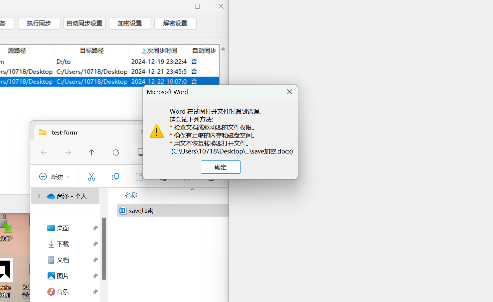
    </div>
    <div style="color: black; border-bottom: 1px solid #d9d9d9; display: inline-block; padding: 2px; text-align: center;">
        图4-5-4 被加密文件无法打开
    </div>
</center>

- 点击同步任务列表中加密过的任务，再点击上方“解密设置”按钮，选择“源文件”测试为源文件，输入设置好的密码进行解密。

<center>
    <div style="display: flex; justify-content: center; align-items: center; padding: 20px;">
        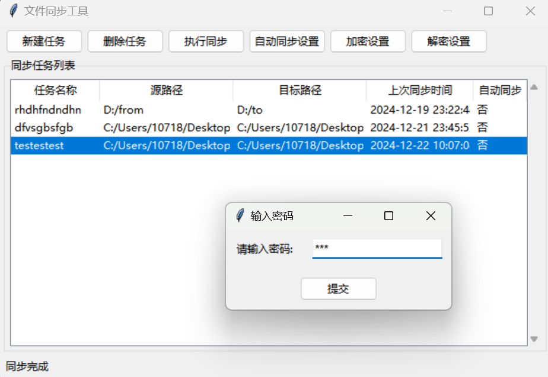
    </div>
    <div style="color: black; border-bottom: 1px solid #d9d9d9; display: inline-block; padding: 2px; text-align: center;">
        图4-5-5 输入密码
    </div>
</center>

- 解密成功，原被加密文件已恢复正常。

<center>
    <div style="display: flex; justify-content: center; align-items: center; padding: 20px;">
        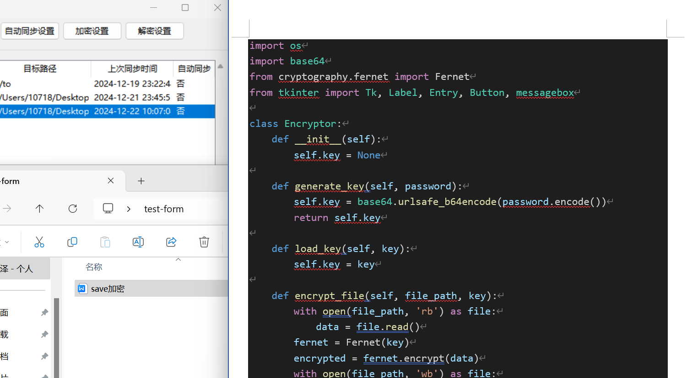
    </div>
    <div style="color: black; border-bottom: 1px solid #d9d9d9; display: inline-block; padding: 2px; text-align: center;">
        图4-5-6 解密后文件成功打开
    </div>
</center>


## 5 讨论与结论

### 5.1 遇到的困难
1. 在任务名称为纯数字的时候，会出现无法同步的情况，原因是在做任务名称比配的时候，纯数字会被识别为int型，而int型无法与字符串进行比配，导致无法找到对应的文件。最终解决方案是将任务名称强制类型转换为字符串。
2. 在自动同步功能中，有时会出现时间未刷新的情况，在经过一番排查后解决了。
3. 在生成.exe文件并运行，会弹出cmd窗口，后来把.py后缀改为.pyw后，再生成.exe文件并运行，就不会弹出cmd窗口了。
4. 实现文件的加解密功能时，软件对文件夹无法操作，且会被系统防火墙识别为病毒程序，最后通过使用安全程度更高的base64库、优化加密过程得以解决。

### 5.2 收获
1. 在设计过程中，我们对软件的功能模块、原理、流程等有了更深入的理解，对软件的设计有了更全面的认识。
2. 同时，我们对软件的界面设计、功能实现、代码编写、测试等有了更加深入的理解，对软件的开发有了更加全面的认识。
